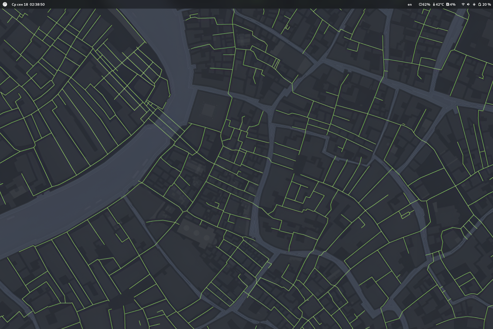
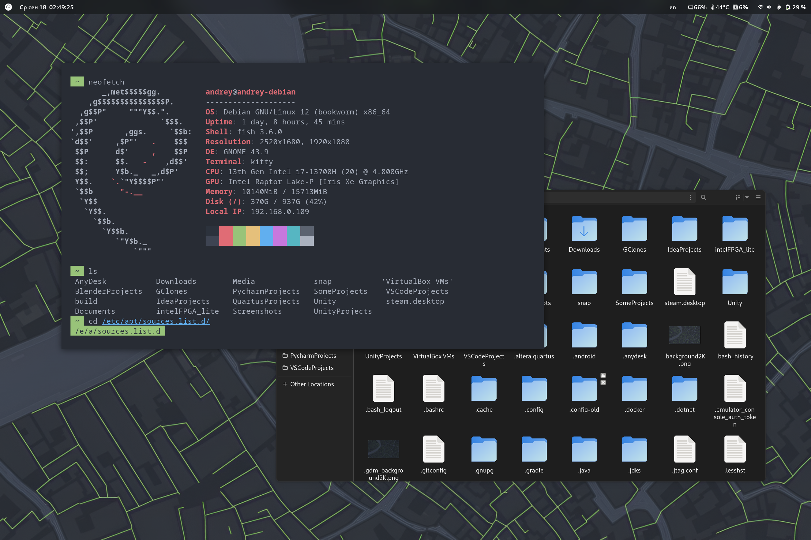
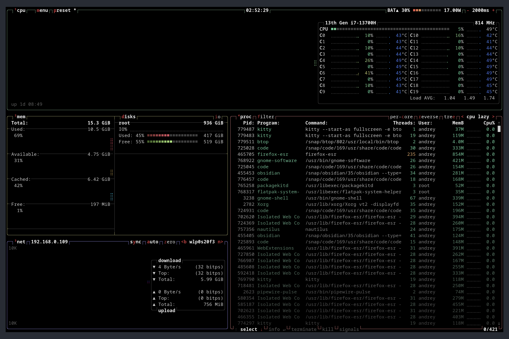
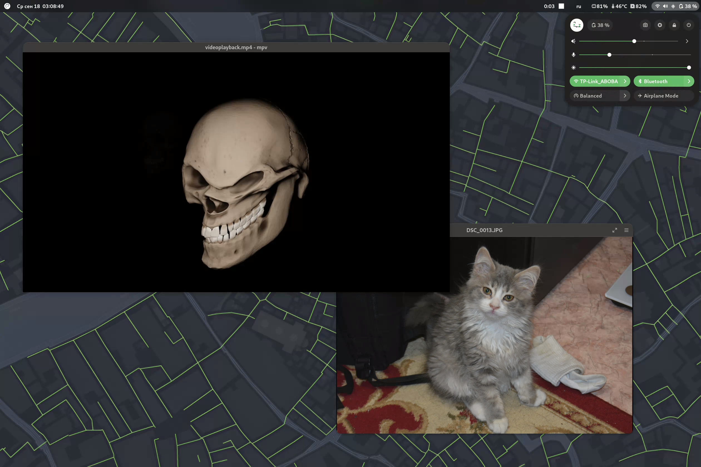

# Dotfiles
## Introduction
This repository was created to quickly install my settings, configs and applications on Debian Gnome. This dotfile parodies the capabilities of bspwm (switching desktops, disabling minimize buttons, closing windows, etc.), but leaves the original settings and applications native to gnome.
# About
- **Distro:** Debian 12 (bookworm)
- **Display Server:** X11
- **Display Manager:** GDM
- **Desktop Environment:** Gnome 43.9


- **Terminal:** Kitty
- **CLI Shell:** Fish
- **File Manager:** Nautilus


- **Sound Mixer:** PulseAudio
- **Task Manager:** btop++



- **Media Player:** MPV
- **GTK Theme:** Orchis green dark


- **Web Browser:** Firefox
- **Torrent Client:** qBitTorrent
- **Quick Access Toolbar (Dock replacement):** Gnome Pie


# Setup
## Debian Expert Installer
First, you need to install the Debian 12 image. The installation can be done via a USB flash drive.
Next, select the following options:
`Advanced options -> Expert install`
#### Choose language
- Language: `English`
- Country: `other -> Europe -> Russian Federation` (This method is used to select Russian as a secondary language)
- Default locale: `United States (en_US.UTF-8)`
- Other locale: `ru_RU.UTF-8`
- Select default locale: `en_US.UTF-8`
#### Detect and mount installation media
- Activate
#### Load installer components from installation media
- don't specify anything, just click `Continue`
#### Detect network hardware
- Activate
#### Configure the network
- Auto-configure networking?: `Yes`
- Just click `Continue`
- Hostname: измените его на то, что вы хотите (например, `"andrey-debian"`)
- Domain name: `Continue`
#### Set up users and passwords
- Allow login as root?: `No`
- Full name for the new user: you can just skip
- Username for your account: preferably in small letters (it will be more convenient, for example, `"andrey"`)
- Choose a password for the new user: Just a password
#### Configure the clock
- Set the clock using NTP?: `Yes`
- NTP server to use: Just click `Continue`
- Select your time zone: Choose your option
#### Detect disks
- Activate
#### Partition disks
- you can handle it yourself :)
#### Install the base system
- Kernel to install: `linux-image-amd64` (for example)
- Drivers to include in the initrd: `generic: include all available drivers`
#### Configure the package manager
- Scan extra installation media?: `No`
- Use a network mirror?: `Yes`
- Protocol for file downloads: `http`
- Debian archive mirror country: choose your country
- Debian archive mirror: `deb.debian.org`
- Just click `Continue`
- Use non-free firmware?: `Yes`
- Use non-free firmware?: `Yes`
- Enable source repositories in APT?: `Yes`
- Services to use: Just click `Continue`
#### Select and install software
- Updates management on this system: `No automatic updates`
- Participate in the package usage survey?: `No`
- Choose software to install: Leave everything as it is, just click `Continue`
#### Install the GRUB boot loader
- Run os-prober automatically to detect and boot other OSes?: `Yes`
- Install the GRUB boot loader to your primary drive?: `Yes`
#### Finish the installation
- Is the system clock set to UTC?: `Yes`
- Please choose `<Continue>` to reboot: `Continue`
## Manual installation
### Removing applications
I left some applications from gnome, because they are more convenient than their counterparts and have functionality related to gnome itself, but I deleted some of them:
#### Update packages
```Terminal
sudo apt update -y && sudo apt upgrade -y
```
#### Remove this packages
```Terminal
sudo apt remove gnome-contacts gnome-weather gnome-2048 gnome-maps aisleriot gnome-calendar gnome-chess gnome-system-monitor gnome-logs gnome-characters five-or-more four-in-a-row hitori gnome-klotski lightsoff gnome-mahjongg gnome-mines gnome-music gnome-nibbles quadrapassel rhythmbox gnome-robots shotwell gnome-sound-recorder gnome-sudoku swell-foop tali gnome-taquin gnome-tetravex seahorse iagno totem
```
#### Remove applications from the dock
```Terminal
gsettings set org.gnome.shell favorite-apps "[]"
```
### Installing applications
#### Snap installing
Before you start installing applications, you need to install snap, for easy installation of other applications.
```Terminal
sudo apt update -y && sudo apt upgrade -y
sudo apt install snapd -y
```
#### Required applications
The following applications are required to install for easy use. I decided not to stray far from the decision of the author of the [repository](https://github.com/addy-dclxvi/debian-bspwm-dotfiles) and also use the `kitty` terminal with `fish`.
```Terminal
sudo snap install btop
sudo apt install -y dconf-editor fish gnome-pie grub-customizer kitty pulseaudio curl
```
If your laptop is Huawei 14s/16s, you may have some sound problems. To solve this, run the fix [script](scripts/fixes/huawei_sound_fix/install.sh) (taken from [here](https://github.com/Smoren/huawei-ubuntu-sound-fix)).

I also recommend using `flameshot` instead of the standard screenshot app:
```Terminal
sudo apt remove gnome-screenshot && sudo apt install -y flameshot
```
#### Optional applications
For my tasks, I use the following minimal application stack. This installation is optional.
```Terminal
sudo apt update -y && sudo apt upgrade -y
sudo apt install -y code telegram-desktop qbittorrent
sudo snap install pycharm-community --classic
sudo snap install intellij-idea-community --classic
sudo snap install obsidian --classic
sudo snap install arduino
sudo snap install discord
```
AnyDesk **([anydesk.sh](scripts/apps/anydesk.sh))**:
```Terminal
#!/bin/bash
wget -qO  https://keys.anydesk.com/repos/DEB-GPG-KEY | apt-key add -
echo "deb http://deb.anydesk.com/ all main" > /etc/apt/sources.list.d/anydesk-stable.list
sudo apt update -y
sudo apt apt install anydesk -y
```
Docker **([docker.sh](scripts/apps/docker.sh))**:
```Terminal
#!/bin/bash
# Add Docker's official GPG key:
sudo apt update -y
sudo apt install -y ca-certificates curl
sudo install -m 0755 -d /etc/apt/keyrings
sudo curl -fsSL https://download.docker.com/linux/debian/gpg -o /etc/apt/keyrings/docker.asc
sudo chmod a+r /etc/apt/keyrings/docker.asc

# Add the repository to Apt sources:
echo \
  "deb [arch=$(dpkg --print-architecture) signed-by=/etc/apt/keyrings/docker.asc] https://download.docker.com/linux/debian \
  $(. /etc/os-release && echo "$VERSION_CODENAME") stable" | \
  sudo tee /etc/apt/sources.list.d/docker.list > /dev/null
sudo apt update -y

sudo apt install docker-ce docker-ce-cli containerd.io docker-buildx-plugin docker-compose-plugin
```
Yandex Music **([yandex_music.sh](scripts/apps/yandex_music.sh))**:
```Terminal
#!/bin/bash
# Variables
REPO_URL="https://api.github.com/repos/cucumber-sp/yandex-music-linux/releases/latest"
TEMP_DEB="/tmp/yandex-music-linux.deb"
# Install dependencies
sudo apt-get update
sudo apt-get install -y curl jq
# Get the download URL of the latest release, filtering for .deb files that contain "amd64"
DOWNLOAD_URL=$(curl -s $REPO_URL | jq -r '.assets[] | select(.name | endswith(".deb") and contains("amd64")) | .browser_download_url')
# Check if the URL is empty
if [ -z "$DOWNLOAD_URL" ]; then
    echo "Could not find an amd64 .deb file in the latest release."
    exit 1
fi
# Download the .deb file
curl -L -o $TEMP_DEB "$DOWNLOAD_URL"
# Install the package
sudo dpkg -i $TEMP_DEB
# Fix missing dependencies if any
sudo apt-get install -f
# Remove the temporary file
rm $TEMP_DEB
```
# Keybinds
Keybinds were made based on the names of applications or associations with them. To launch the rest of the applications, `gnome pie` or search is used (clicking on win and entering the name).
- **`Super + Enter`** Launch terminal
- **`Alt + A`** Launch Gnome Pie
- **`Super + Q`** Close window
- **`Super + W`** Launch Web Browser
- **`Super + E`** Launch Nautilus
- **`Super + T`** Launch Telegram
- **`Super + Y`** Launch Yandex music
- **`Super + O`** Launch Obsidian
- **`Super + P`** Change the monitor mode
- **`Super + A`** Minimize the window
- **`Super + S`** Launch Settings
- **`Super + D`** Launch Discord
- **`Super + K`** Log Out
- **`Super + L`** Lockscreen
- **`Super + ;`** Power off
- **`Super + C`** Launch Calculator
- **`Super + B`** Launch btop++
- **`Super + Tab`** Change the window in the current workspace
- **`Super + {number}`** Switch to the `{number}` workspace
- **`Super + Shift + {number}`** Move the window to the `{number}` workspace
- **`Alt + Tab`** Change the window on all workspaces
- **`PrtSc`** Take screenshot using flameshot
- **`Shift + PrtSc`** Open flameshot settings
- **`Super + LMB`** Move window
- **`Super + MMB`** Resize window
## Credits
Some material was taken from other repositories and has been slightly modified:
- [Debian bspwm dotfiles](https://github.com/addy-dclxvi/debian-bspwm-dotfiles) | **Author:** [addy-dclxvi](https://github.com/addy-dclxvi) | **Taken:** background image, `kitty` config, `fish` config, some keybinds
- [Orchis theme](https://github.com/vinceliuice/Orchis-theme) | **Author:** [vinceliuice](https://github.com/vinceliuice) | **Taken:** green dark theme
- [Huawei ubuntu sound fix](https://github.com/Smoren/huawei-ubuntu-sound-fix) | **Author:** [Smoren](https://github.com/Smoren) | **Info:** for huawei 14s / 16s users (also work with Debian)
- [plymouth themes](https://github.com/adi1090x/plymouth-themes) | **Author:** [adi1090x](https://github.com/adi1090x) | **Taken:** used `cubes` theme from pack 1